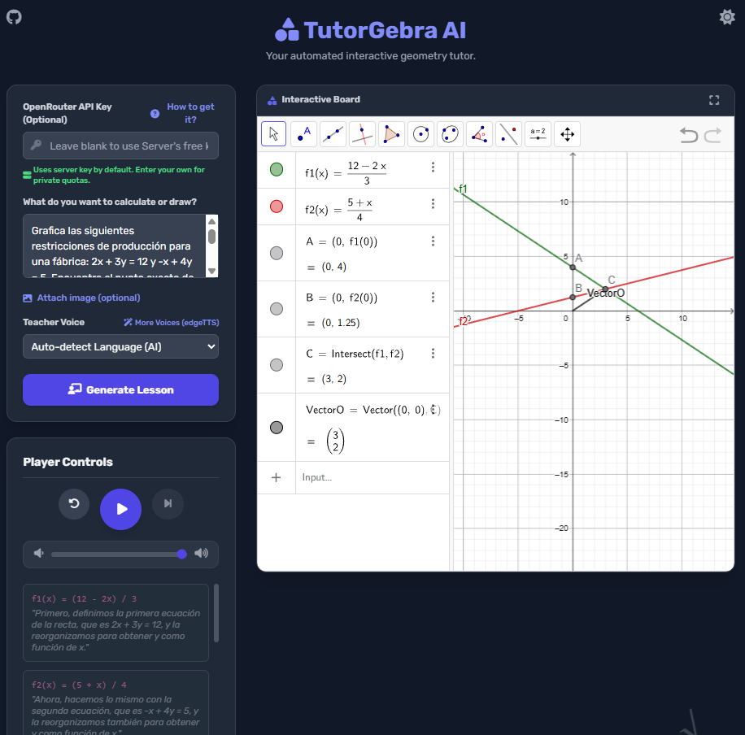

# TutorGebra AI 📐🤖



TutorGebra AI is an automated, multilingual, interactive geometry and mathematics tutor. 

You provide a mathematical exercise in natural language, and the system uses **OpenRouter** to route your requests to powerful AI models (like Google's latest Gemini) to break it down into a pedagogical step-by-step lesson plan. It then renders a beautifully integrated **Interactive GeoGebra Player** right in your browser, drawing the exercise step-by-step while a native **Text-to-Speech (TTS)** engine reads the mathematical explanations out loud in your preferred language and accent!

## ✨ Features
- **Embedded Interactive Player:** No external windows required! Watch the math unfold in a fully interactive embedded GeoGebra applet with Play, Pause, and Replay controls.
- **Multilingual & Native Accents:** Automatically detects your input language and allows you to customize the teacher's accent (e.g., Spanish from Spain/Mexico, English from US/UK/Australia, French).
- **Simulated Typing Terminal:** A modern, floating terminal overlay simulates the bot typing algebraic commands in real-time before executing them.
- **Dynamic Interactivity:** Automatically enforces the creation of interactive sliders for dynamic variables, allowing you to manipulate the geometry after the automated lesson finishes.
- **Responsive & Fullscreen Modes:** Works smoothly on different screen sizes and includes a gorgeous Fullscreen mode with a cinematic dark backdrop to focus entirely on the math.

---

## 🛠️ Requirements & Dependencies

To run this project, you will need:
- **Python 3.12+**
- **OpenRouter API Key** (You can get one for free at [openrouter.ai/keys](https://openrouter.ai/keys))

### Libraries Used:
- `fastapi` & `uvicorn` (Web server & REST API)
- `openrouter` (High-availability SDK for auto-routing to AI models)
- `gTTS` (Google Text-to-Speech synthesis)
- `Vue 3` & `TailwindCSS` (Frontend framework and styling)
- `GeoGebra JS API` (Interactive math rendering)

---

## 🚀 How to Install and Run

### The "1-Click" Way (Recommended)
We've included automated setup scripts that create a virtual environment, install all dependencies, and start the server for you.
- **Windows:** Double-click `install_and_run.bat`
- **Linux/Mac:** Run `bash install_and_run.sh` in your terminal.

### The Manual Way
1. Clone or download the repository.
2. Create and activate a virtual environment:
   ```bash
   python -m venv .venv
   # Windows: .venv\Scripts\activate
   # Mac/Linux: source .venv/bin/activate
   ```
3. Install the required dependencies:
   ```bash
   pip install -r requirements.txt
   ```
4. Start the TutorGebra server:
   ```bash
   python app/main.py
   ```
5. Open your browser and visit: **http://localhost:8000**

---

## 🧠 How to Use

1. Once the web interface is open, if you don't know how to get an API Key, click on the **"¿Cómo obtenerla?"** button for a quick tutorial.
2. Paste your **OpenRouter API Key** in the designated field (or leave it blank to use the server's default free key).
3. Select your preferred **Teacher Voice / Accent**.
4. Type an exercise prompt in your language of choice. 
   *Example: "Draw a right triangle, calculate its hypotenuse using the Pythagorean theorem, and draw a circumscribed circle."*
5. Click on **"Generar Lección"**.
6. Enjoy the show! Use the **Player Controls** to pause, advance to the next step, or restart the explanation at your own pace. Click the **Fullscreen** button on the top right of the board to maximize your focus.

## 🏗️ Advanced AI Architecture (2026 Update)

TutorGebra uses a state-of-the-art **Smart Content Routing** system to maximize mathematical accuracy while minimizing API costs.

### 1. Smart Content Routing (OCR & Classification)
When a user submits a prompt (with or without an image), the system does **not** send it blindly to an expensive AI. Instead:
1. **The Gatekeeper (`gpt-4o-mini`)**: This ultra-cheap, fast model intercepts the request. If an image is provided, it performs flawlessly cheap OCR to extract mathematical text.
2. **Difficulty Classification**: It determines if the problem is `basic` (high school algebra/drawings) or `advanced` (university-level physics, complex calculus, abstract algebra).
3. **Dynamic Routing**:
   - If `basic`: The system saves money by keeping the request with `gpt-4o-mini`, which excels at traditional algebra and explicit geometry.
   - If `advanced`: The system **strips the heavy image** from memory (saving massive Vision API costs), constructs a pure-text prompt with the extracted math, and routes it to heavy-hitters like **`openai/gpt-4o`** or **`anthropic/claude-sonnet-5.5`**.

### 2. Auto-Recovery Shield (Retry Loop)
Due to API limits, 10-second timeouts on OpenRouter, or insufficient prepaid funds, advanced models can occasionally fail or return truncated `JSONDecodeError` responses.
To prevent the frontend from crashing, TutorGebra implements a resilient **3-Tier Retry Loop**:
- **Attempt 1**: `anthropic/claude-sonnet-5.5` (The genius math physicist).
- **Attempt 2**: If Claude times out (10s limit) or truncates, it seamlessly falls back to `openai/gpt-4o` (Lightning fast, exceptional spatial reasoning).
- **Attempt 3**: If out of credits (HTTP 402), it suppresses the error and falls back to `openai/gpt-4o-mini` to ensure the user ALWAYS gets a lesson without the server crashing.


### 4. Overcoming Hallucinations with "Severity Tagging"
During testing, we discovered that LLMs frequently hallucinate commands (like `RegularPolygon()` or `Polygon(center, vertex)`) because of their mathematical priors. We found that the **best approach to reduce LLM hallucination** is to decouple every single rule into a standalone bullet point prefixed with a highly aggressive, capitalized severity tag (e.g., `**[RULE NAME] (CRITICAL):**` or `**(FATAL ERROR):**`). This forces the attention mechanism of the LLM to prioritize the constraint over its statistical prior, ensuring it obeys strict GeoGebra web-engine quirks (like using `Vertex(polygon, n)` to explicitly extract vertices for commands like `Incircle` or `AngleBisector`).

### 3. Strict Mathematical Syntax Rules
To prevent catastrophic GeoGebra Applet crashes caused by LLMs "knowing too much" standard math notation, TutorGebra injects critical overrides:
- **Forced Uppercase Points**: Variables like `tangentPoint` or `z1` (common in Complex Analysis) evaluate as Vectors in GeoGebra and crash functions like `Polygon()`. The system strictly forces the AI to use `TangentPoint` or `Z1`.
- **Banned Manual Calculus**: Models are forbidden from manually calculating slope derivatives to draw lines; they are forced to use GeoGebra's native `Tangent(Point, Function)` engine to prevent spatial hallucinations.

---

## 🧪 Disclaimer & Contributing

**1. Experimental Project:** Please note that TutorGebra AI is an highly experimental project. It is currently being developed and maintained by a developer who does not possess advanced or specialized mathematical knowledge. Because mathematics is incredibly vast, many edge cases, complex geometrical constructions, and advanced calculus scenarios are not yet fully covered by the AI's internal guardrails. As a result, the application might occasionally crash, the AI might hallucinate invalid GeoGebra commands, or it might construct a mathematically flawed explanation.

**2. Contributions are Highly Encouraged:** If you encounter hallucinations, bad text formatting in the UI, GeoGebra syntax crashes, or mathematical logic errors, your help is warmly welcomed! Please feel free to open an **Issue** on the repository to report the bug, or submit a **Pull Request (PR)** if you know how to fix it in the code or system prompt. 

**3. Calling All Mathematicians:** This project relies on continuous collaboration. We desperately need the support of mathematicians, teachers, and domain experts who *actually* know the math to help us refine the model's inference rules. Your expertise can help us write better, stricter guardrails in the `system_prompt.md` to prevent the AI from making complex mathematical mistakes, ultimately creating a more robust and reliable educational tool for everyone.

---

## 💡 Example Prompts to Test / Prompts de Ejemplo

You can copy and paste any of these prompts directly into the TutorGebra interface to test different mathematical domains and GeoGebra tools. Prompts can be entered in Spanish, English, or any other supported language.

### 🟢 Geometría Básica (Basic Geometry)

* **Triángulo Rectángulo y Teorema de Pitágoras:**
  > *"Dibuja un triángulo rectángulo con catetos de longitud 3 y 4. Calcula la hipotenusa usando el teorema de Pitágoras y traza la circunferencia circunscrita."*

* **Puntos Notables de un Triángulo (Baricentro y Medianas):**
  > *"Construye un triángulo con vértices en A=(1,1), B=(7,2) y C=(3,6). Traza las medianas de cada lado y encuentra su baricentro."*

* **Polígono Regular e Incentro:**
  > *"Dibuja un pentágono regular centrado en el origen con radio 4. Traza las bisectrices de dos de sus ángulos y halla su circunferencia inscrita."*

---

### 🎛️ Geometría Dinámica y Deslizadores (Interactive Sliders)

* **Parábola Interactiva con Parámetros:**
  > *"Crea tres deslizadores: 'a' entre -5 y 5, 'b' entre -5 y 5, y 'c' entre -5 y 5. Grafica la función cuadrática f(x) = a*x^2 + b*x + c y marca su vértice."*

* **Círculo con Radio Dinámico y Recta Tangente:**
  > *"Crea un deslizador 'r' para el radio entre 1 y 10. Traza una circunferencia de radio r con centro en (0,0), coloca un punto sobre ella y traza su recta tangente."*

---

### 📈 Funciones y Geometría Analítica (Analytic Geometry)

* **Intersección de Recta y Circunferencia:**
  > *"Grafica la circunferencia x^2 + y^2 = 25 y la recta y = 2*x + 1. Encuentra y resalta los puntos de intersección entre ambas."*

* **Elipse y sus Focos:**
  > *"Dibuja una elipse con ecuación x^2/25 + y^2/9 = 1. Identifica y grafica sus focos, sus vértices y sus ejes mayor y menor."*

---

### 📐 Trigonometría (Trigonometry)

* **Círculo Unitario y Proyección de Seno y Coseno:**
  > *"Dibuja la circunferencia unitaria centrada en el origen. Crea un deslizador de ángulo 'alpha' de 0 a 360 grados, un punto móvil P sobre el círculo y segmentos perpendiculares a los ejes que ilustren el seno y el coseno de ese ángulo."*

---

### 🚀 Cálculo (Calculus)

* **Recta Tangente y Pendiente en una Cúbica:**
  > *"Grafica la función cúbica f(x) = x^3 - 3*x. Crea un deslizador 'x0' y traza la recta tangente a la función en el punto (x0, f(x0)) mostrando su pendiente."*

* **Derivadas y Puntos Críticos:**
  > *"Grafica la función f(x) = x^4 - 4*x^2. Calcula y grafica su derivada f'(x), y marca los puntos de máximos y mínimos locales."*