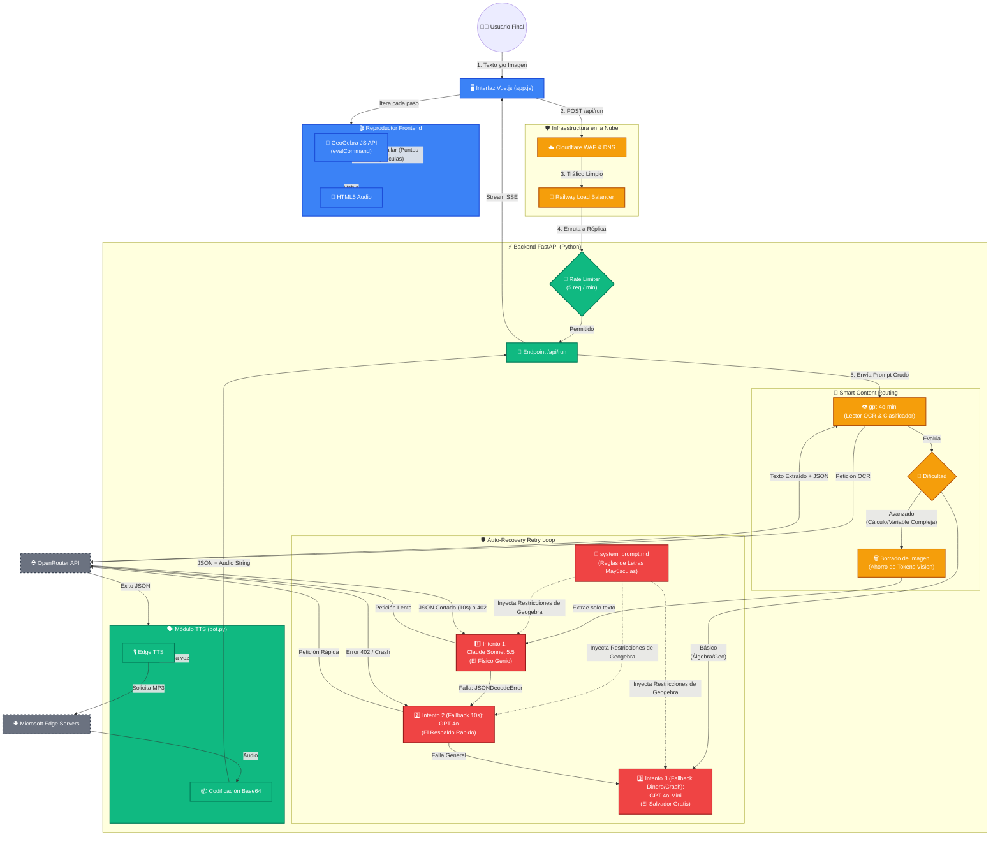

# Flujo de Arquitectura y Ciclo de Vida: TutorGebra AI (v2 - OpenRouter Edition)

Este diagrama ilustra el viaje completo de una petición en TutorGebra, incluyendo la nueva **Gestión de Contenidos Inteligente (Smart Routing)**, el sistema de **Auto-Recuperación de Fallos (Retry Loop)** y la orquestación a través de **OpenRouter**.

## Análisis de los Modelos en la Arquitectura

El sistema de enrutamiento distribuye inteligentemente el tráfico basándose en las fortalezas y debilidades de cada modelo, optimizando los costos de la API de OpenRouter.

### 1. `gpt-4o-mini` (El Portero y Clasificador)
* **Rol:** Ejecutar OCR (Reconocimiento Óptico de Caracteres), clasificar la dificultad y resolver álgebra clásica.
* **Por qué es bueno:** Es increíblemente rápido y su costo por procesar imágenes es fraccional. Es brillante aislando variables algebraicamente (ej. despejar $y$ en $2x + 3y = 12$) y escribiendo código JSON sin romperlo.
* **Por qué es malo:** Tiene un razonamiento espacial pésimo. Alucina posiciones geométricas, ubica los polos matemáticos en lugares incorrectos y no tiene la profundidad académica para ecuaciones diferenciales o topología.

### 2. `claude-sonnet-5.5` (El Físico Matemático)
* **Rol:** Modelo primario para problemas universitarios avanzados.
* **Por qué es bueno:** Es el rey indiscutible de la deducción lógica compleja. Puede estructurar lecciones pedagógicas de altísimo nivel.
* **Por qué es malo:** Es muy costoso para procesar visión pesada (lo cual solucionamos extirpando la imagen). En OpenRouter sufre problemas de timeout (10 segundos) que cortan la respuesta JSON a la mitad si se toma demasiado tiempo pensando en problemas largos.

### 3. `gpt-4o` (El Respaldo de Alta Velocidad)
* **Rol:** Modelo secundario de emergencia para problemas avanzados.
* **Por qué es bueno:** Tiene una inteligencia académica casi idéntica a Claude, pero transmite (streams) los resultados mucho más rápido a través de OpenRouter, eludiendo eficazmente los bloqueos de 10 segundos.
* **Por qué es malo:** Debido a su vasta base de datos matemáticos, tiene un sesgo inherente hacia la notación matemática estándar (ej. usar $z_1$, $z_2$ minúsculas en Variable Compleja). Esto obligó a la arquitectura a imponer restricciones estrictas en el System Prompt para forzarlo a usar Mayúsculas en los puntos y evitar crashear GeoGebra.
