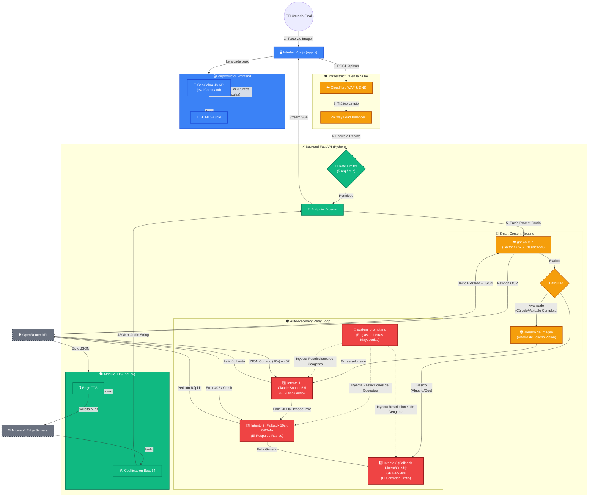
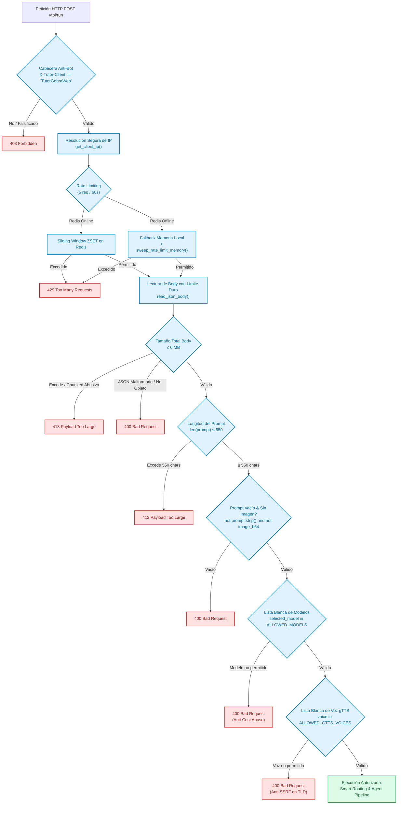
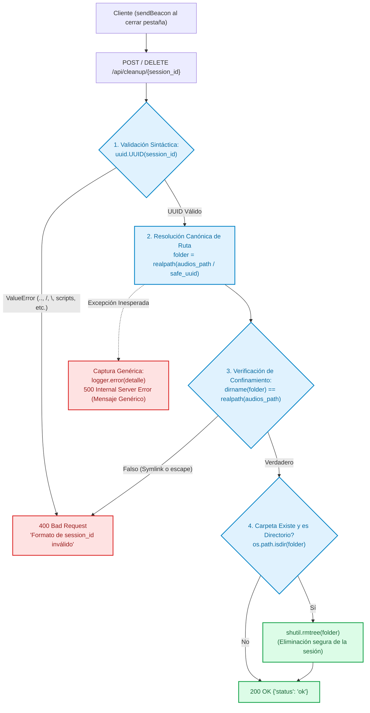

# Flujo de Arquitectura y Ciclo de Vida: TutorGebra AI (v2 - OpenRouter Edition)

Este diagrama ilustra el viaje completo de una petición en TutorGebra, incluyendo la nueva **Gestión de Contenidos Inteligente (Smart Routing)**, el sistema de **Auto-Recuperación de Fallos (Retry Loop)** y la orquestación a través de **OpenRouter**.

## Análisis de los Modelos en la Arquitectura

El sistema de enrutamiento distribuye inteligentemente el tráfico basándose en las fortalezas y debilidades de cada modelo, optimizando los costos de la API de OpenRouter.

### 1. `gpt-4o-mini` (El Portero y Clasificador)
* **Rol:** Ejecutar OCR (Reconocimiento Óptico de Caracteres), clasificar la dificultad y resolver álgebra clásica.
* **Por qué es bueno:** Es increíblemente rápido y su costo por procesar imágenes es fraccional. Es brillante aislando variables algebraicamente (ej. despejar $y$ en $2x + 3y = 12$) y escribiendo código JSON sin romperlo.
* **Por qué es malo:** Tiene un razonamiento espacial pésimo. Alucina posiciones geométricas, ubica los polos matemáticos en lugares incorrectos y no tiene la profundidad académica para ecuaciones diferenciales o topología.

### 2. `claude-sonnet-5.5` (El Físico Matemático)
* **Rol:** Modelo primario para problemas universitarios avanzados.
* **Por qué es bueno:** Es el rey indiscutible de la deducción lógica compleja. Puede estructurar lecciones pedagógicas de altísimo nivel.
* **Por qué es malo:** Es muy costoso para procesar visión pesada (lo cual solucionamos extirpando la imagen). En OpenRouter sufre problemas de timeout (10 segundos) que cortan la respuesta JSON a la mitad si se toma demasiado tiempo pensando en problemas largos.

### 3. `gpt-4o` (El Respaldo de Alta Velocidad)
* **Rol:** Modelo secundario de emergencia para problemas avanzados.
* **Por qué es bueno:** Tiene una inteligencia académica casi idéntica a Claude, pero transmite (streams) los resultados mucho más rápido a través de OpenRouter, eludiendo eficazmente los bloqueos de 10 segundos.
* **Por qué es malo:** Debido a su vasta base de datos matemáticos, tiene un sesgo inherente hacia la notación matemática estándar (ej. usar $z_1$, $z_2$ minúsculas en Variable Compleja). Esto obligó a la arquitectura a imponer restricciones estrictas en el System Prompt para forzarlo a usar Mayúsculas en los puntos y evitar crashear GeoGebra.

---

## Pipeline de Seguridad, Blindaje y Validación (Zero-Trust)

Para garantizar la estabilidad y proteger la infraestructura en producción (Railway), se implementó una arquitectura de defensa en profundidad orientada a neutralizar vectores de ataque web (Path Traversal, SSRF, saturación de memoria/tokens, bypass de Rate Limiting y fuga de secretos).

### 1. Pipeline de Validación en `/api/run`

Toda solicitud entrante debe superar una serie de compuertas deterministas antes de que se autorice la llamada al agente de inteligencia artificial o a los motores de síntesis de voz.

### 2. Ciclo de Vida y Limpieza Segura de Sesiones (`/api/cleanup/{session_id}`)

Para eliminar de forma segura los audios temporales sin permitir ataques de borrado masivo o transversal de directorios (*Arbitrary File Deletion / Path Traversal*):

### 3. Matriz de Controles y Validaciones Implementadas

| Componente | Vulnerabilidad / Riesgo Mitigado | Mecanismo de Validación |
| :--- | :--- | :--- |
| **Sesiones (`/api/cleanup`)** | Path Traversal / Borrado masivo arbitrario de archivos con secuencias `%2e%2e` o `..`. | Validación estricta `uuid.UUID()` + confinamiento canónico mediante `os.path.realpath()`. |
| **Síntesis de Voz (`voice`)** | SSRF (*Server-Side Request Forgery*) mediante manipulación del parámetro TLD en Google Translate (`translate.google.{tld}`). | Lista blanca cerrada `ALLOWED_GTTS_VOICES` mapeada a tuplas fijas e inmutables `(lang, tld)`. |
| **Selección de Modelo (`selected_model`)** | Abuso de costes de API contra la clave del servidor (`OPENROUTER_API_KEY`). | Lista blanca `ALLOWED_MODELS` restringida a los 4 modelos oficiales de la interfaz. |
| **Identificación de Cliente (`get_client_ip`)** | Evasión de Rate Limiting mediante falsificación de cabeceras `X-Forwarded-For`. | Extracción determinista del salto confiable del proxy de Railway (`TRUSTED_PROXY_HOPS`) y normalización con la librería `ipaddress`. |
| **Memoria de Rate Limit (`ip_requests`)** | Fuga de memoria / DoS por acumulación infinita de claves en el diccionario de IPs en memoria. | Límite máximo de IPs rastreadas (`MAX_TRACKED_IPS = 10,000`) y barrido periódico automático (`sweep_rate_limit_memory`). |
| **Tamaño de Carga (`read_json_body`)** | Saturación de memoria RAM por cuerpos JSON masivos o transferencias fragmentadas (*chunked*). | Lectura de flujo de red con corte estricto a los 6 MB (`MAX_BODY_BYTES`). |
| **Campo de Entrada (`prompt`)** | Consumo abusivo de tokens en llamadas LLM y desbordamiento de búfer lógico. | Límite estricto de 550 caracteres en backend (`413`) + contador y deshabilitación reactiva en frontend (`:disabled="!canGenerate"`). |
| **Procesamiento de Imágenes (`handleImageUpload`)** | Latencia y sobrecoste de tokens de visión en OpenRouter por fotos de alta resolución. | Redimensionamiento y recompresión *client-side* en Canvas HTML5 a JPEG máx 1600px antes de codificar en base64. |
| **Construcción de Contenedores (`.dockerignore`)** | Filtración involuntaria de claves de API (`.env`) en capas públicas de la imagen Docker. | Exclusión explícita de `.env` y `*.env` en el archivo `.dockerignore`. |

