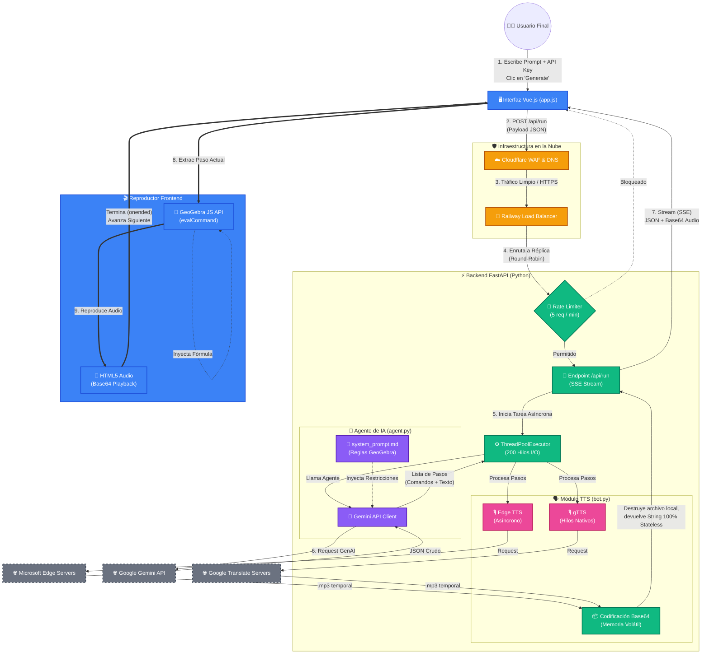

# Flujo de Arquitectura y Ciclo de Vida: TutorGebra AI

Este diagrama ilustra el viaje completo de una petición en TutorGebra, desde el clic del usuario hasta la renderización matemática y reproducción de voz.

